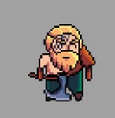
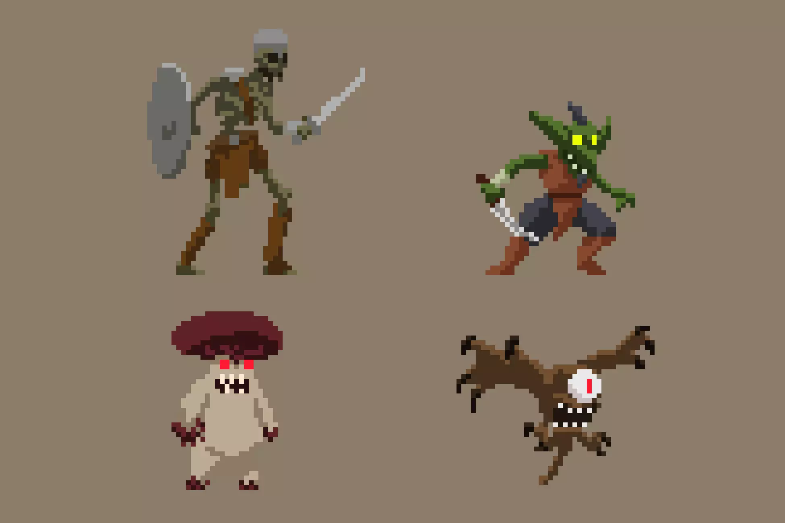

# **Lumberjack Warrior**

## **Concept**

Pixelated platformer game where the warrior overcomes obstacles, solves puzzles and fights/evade enemies, leading to a final
battle.

## Genre

2D Action Platformer

## Characters & Design

We will be using the following characters assets in *Lumberjack Warrior*.

### Player Character

- **Lumberjack Warrior**: The main playable character, a brave warrior navigating challenges.
    - **Asset Used**: [Warrior Pixel Art Sprite](https://craftpix.net/freebies/free-warrior-pixel-art-sprite-sheets/)
    - **Abilities**: Running, jumping, attacking, breaking objects
  
      

### Enemies

1. **Regular Enemies**: Various monsters appearing throughout the levels.
    - **Asset Used**: [Monsters & Creatures Sprite Pack](https://assetstore.unity.com/packages/2d/characters/monsters-creatures-fantasy-167949)
    - **Behavior**: Different attack patterns, movement styles and increasing difficulty
    

2. Boss Enemy
    - **Final Boss**: Frost Guardian serving as final challenge.
    - **Asset Used**: [Frost Guardian Final Boss Sprite](https://chierit.itch.io/boss-frost-guardian)
    - **Abilities**: Different type of attack pattern and projectile based attack
       

These assets will define the visual and gameplay identity of Lumberjack Warrior.

## Player Experience & Game POV

The player takes on the role of a brave warrior, navigating through challenges, solving puzzles and battling/evading enemies.
The goal is to create an immersive experience with smooth combat including some puzzle-solving mechanics.

## Visual & Art Style

- Classic pixel-art with vibrant environments.
- Retro-styled sound effects and background music to match the theme.

## Platform(s), Technology & Scope

- **Platform**: PC, VIA Arcade Machine
- **Technology**: Unity (C#)
- **Scope**: 4 levels, with the final level featuring a boss fight.

## Core Loops

1. Exploration → Combat → Puzzle Solving → Progression
2. Players navigate around obstacles, solve puzzles and fight/evade enemies to advance.

## Objective & Progression
Each level duration is around 3 minutes on average.

- **Level 1**: Basic level with simple obstacles and easy to defeat enemies. Complete level by retrieving a key from a chest.
- **Level 2**: More difficult enemies and advanced obstacles. Use the key from the previous level to unlock a cage and
  obtain a power-up potion that increases size and health of player.
- **Level 3**: Find and activate a portal to reach the final boss.
- **Level 4**: Defeat the final boss.

## Game Systems

- **Player Mechanics**: Movement, combat, moving items, breaking chests.
- **Enemy AI**: Enemies with unique attack patterns and difficulty scaling.
- **Health System**: Player and enemy health mechanics.
- **Pickups**: Power-up potion, health recovery items.

## MileStones

### Milestone 1

**Goal**: Establish the basic mechanics and ensure the fundamental gameplay works smoothly.

- Implement player movement and attack patterns
- Create basic enemy AI
- Develop basic obstacles and puzzles
- Introduce health system
- Create dummy scene

### Milestone 2

**Goal**: Develop and refine levels.

- Design and Implement 3 levels
- Audio integration, visual effects

### Milestone 3

**Goal**: Enhance user experience and prepare for release.

- Implement final boss fight level
- Implement UI elements (main menu, pause screen)
- Play-testing and bug fixes
- Add victory conditions
