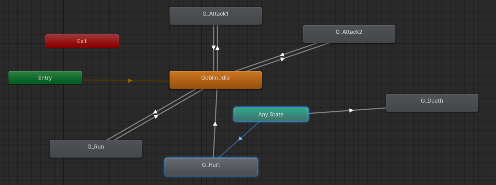

## Apurva Misha

---

## Pramesh Shrestha

---

## Rajib Paudyal (325836)

---

### Created Basic Enemy Animations for Prototyping

For the first task, I set up basic animations for a prototype enemy character—a goblin. I used Unity’s Animator to
create a state machine that controls how the goblin looks and behaves during gameplay.



The animation system includes the following key states:

- **Goblin_Idle** – the default idle animation.
- **G_Run** – plays when the goblin is moving.
- **G_Attack1** and **G_Attack2** – two different attack animations.
- **G_Hurt** – shows when the goblin takes damage.
- **G_Death** – plays when the goblin dies.

---

### Basic AI System for All Enemies

In the second task, I created a basic AI system that all enemy types can use. The enemies patrol between two points and
switch to attack mode when the player is detected.

This AI system is a **quick prototype**, and although it works well for now, I plan to refactor and improve the
structure in future milestones for better performance and flexibility.

---

#### State Management

The enemy uses a simple state machine with two states: `Patrol` and `Attack`.

```csharp
public enum EnemyState { Patrol, Attack }
```

Inside the Update() method, we check if the player is nearby using a detection function, then decide what to do:

```csharp
bool playerDetected = PlayerInRange();
UpdateState(playerDetected);

switch (_currentState)
{
    case State.Patrol:
        HandlePatrol();
        break;
    case State.Attack:
        HandleAttack();
        break;
}
```

#### Player Detection (Raycasting)

The enemy checks for the player using a BoxCast, which acts like a short-range vision field in front of the enemy.

```csharp
Vector3 origin = boxCollider.bounds.center + transform.right * enemyAttackRange * transform.localScale.x * colliderDistance;
Vector3 size = new Vector3(boxCollider.bounds.size.x * enemyAttackRange, boxCollider.bounds.size.y, boxCollider.bounds.size.z);

RaycastHit2D hit = Physics2D.BoxCast(origin, size, 0, Vector2.left, 0, playerLayer);
```

This method was inspired by an online tutorial. Although raycasting can affect performance when overused, it's only
called once per enemy here, so it shouldn't cause any major issues at this stage.

#### Patrolling Behaviour

If the player is not detected, the enemy patrols between two points using the HandlePatrol() method:

```csharp
Transform target = patrolPoints[_currentPatrolIndex];
transform.position = Vector2.MoveTowards(transform.position, target.position, patrolSpeed * Time.deltaTime);
```

Once the enemy reaches a patrol point, it waits briefly before moving again. The patrol point is then switched, and the
enemy flips its sprite to face the other direction.
---