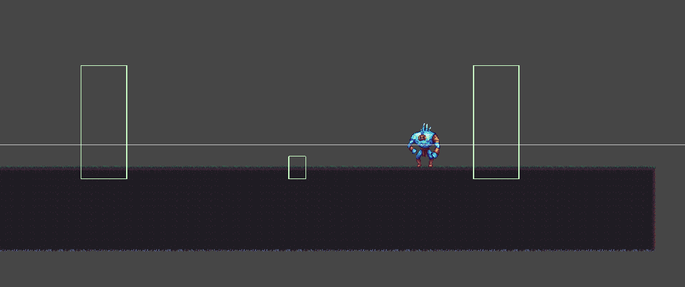

## Apurva Mishra
My tasks in the second milestone consisted of implementing the Final Level for Lumberjack Warrior. In addition to this, I also created a fully functional level boss for the final level.

### Level Design

I kept my level design simple to draw attention to the boss fight. There are no puzzles or complex obstacles. I used Unity's Tilemap system with a Rule Tile to place terrain efficiently. The Rule Tile let me automate edge and corner placements without needing to paint each tile by hand.

For the background, I used a multi-layer parallax effect to add depth. I applied Rajib’s `ParallaxInfiniteScroll` script and tuned four layers to scroll at different speeds. Each layer loops as the player moves, giving the level a smooth and immersive visual flow.


### Arena Lock System

To contain the player within the arena while the boss fight plays out, I built an arena lock. When the player enters the trigger zone, invisible walls activate and trap them inside. This is handled by the `ArenaController`:

```csharp
public class ArenaController : MonoBehaviour
{
    [SerializeField] private GameObject[] arenaWalls;

    public void LockArena()
    {
        foreach (var wall in arenaWalls)
            wall.SetActive(true);
    }

    public void UnlockArena()
    {
        foreach (var wall in arenaWalls)
            wall.SetActive(false);
    }
}
```



### Boss AI System

The boss runs on a custom state machine. Each state follows the Single Responsibility Principle and is defined using the `IBossState` interface. This setup makes it easier to manage transitions between behaviors like intro, attack, and death.

The boss detects when the player is within decision range and either chases or attacks. Movement is restricted to the X-axis, and walking is paused during attacks or special animations. The `BossAttackState` handles this logic:

```csharp
public class BossAttackState : IBossState
{
    private readonly BossController boss;

    public BossAttackState(BossController boss)
    {
        this.boss = boss;
    }

    public void Update()
    {
        var state = boss.Animator.GetCurrentAnimatorStateInfo(0);
        if (state.IsTag("attack") || state.IsTag("hit") || state.IsTag("death") || state.IsTag("intro"))
        {
            boss.SetWalking(false);
            return;
        }

        boss.FacePlayer();

        float distance = Vector2.Distance(boss.transform.position, boss.Player.position);

        if (distance <= boss.AttackDecisionRange)
        {
            boss.SetWalking(false);
            if (boss.IsAttackCooldownReady())
                boss.TryAttack();
        }
        else
        {
            boss.SetWalking(true);
            Vector3 target = boss.Player.position;
            target.y = boss.transform.position.y;
            boss.transform.position = Vector3.MoveTowards(
                boss.transform.position,
                target,
                boss.ChaseSpeed * Time.deltaTime
            );
        }
    }

    public void Enter() => boss.SetWalking(false);
    public void Exit() => boss.SetWalking(false);
}
```

### Boss UI and Health

I added a health bar that stays hidden until the boss fight starts. When the player enters the arena, the boss triggers its intro animation, and the UI is initialized:

```csharp
public void StartBossFight()
{
    if (hasStarted) return;
    hasStarted = true;

    if (bossHealthUI != null)
        bossHealthUI.SetMaxHealth(maxHealth);

    animator.SetTrigger("intro");
    stateMachine.ChangeState(new BossIntroState(this));
}
```

The health bar updates as the boss takes damage. When health reaches zero, the boss plays a death animation and is destroyed.

### Boss Attacks

The boss randomly chooses between three attack types. Each attack has its own animation and hitbox. The system uses `Physics2D.OverlapCircle` to detect if the player is in range.

When hit, the boss flinches and loses health. This feedback helps the player know when they’ve landed a successful hit.

---

## Pramesh Shrestha (325833)

---

## Rajib Paudyal (325836)

For milestone two, I focused on designing and building Level 2 of our game. This included creating the tilemap layout,
decorating the environment and implementing two interactive puzzles.

### Tilemap Creation with Rule Tiles


I built the level layout using Unity’s Tilemap system. To streamline the process, I used Rule Tiles for placing terrain.
Rule Tiles allowed me to define how tiles behave based on their neighbors—automatically selecting corner, edge or
filler tiles depending on the surrounding context. This reduced the amount of manual painting needed and kept the
terrain visuals clean and consistent.


I separated the level into layers for collision, visuals and decorations. This helped organize the work and made it
easier to tweak parts of the level without affecting others.

### Background and Parallax Effect

After completing the core layout and decorations, I added a multi-layered background to enhance the level’s atmosphere.
The goal was to create a sense of depth and motion as the player moves through the level. To achieve this, I used a
parallax scrolling effect. Each background layer moves at a different speed relative to the camera, with distant layers
moving slower and closer layers moving slightly faster. This mimics depth and makes the scene feel more dynamic.

I implemented the effect using a custom script called `ParallaxInfiniteScroll`. The script uses the camera's movement to
update each background layer’s position, giving the illusion of depth. It also supports horizontal wrapping so that the
background repeats seamlessly as the player moves. It calculates a new position based on the camera’s X movement
multiplied by a parallax factor. When the camera moves beyond the sprite’s width, it shifts the background’s start
position to create a seamless loop.

```csharp
private void FixedUpdate()
{
    float temp = (_camera.transform.position.x * (1 - _parallaxEffectX));
    float dist = (_camera.transform.position.x * _parallaxEffectX);

    transform.position = new Vector3(_startPos.x + dist, _startPos.y, transform.position.z);

    // Now, wrap the background!
    if (temp > _startPos.x + _spriteWidth)
    {
        _startPos.x += _spriteWidth;
    }
    else if (temp < _startPos.x - _spriteWidth)
    {
        _startPos.x -= _spriteWidth;
    }
}
```

Each background layer uses this script with a different parallaxEffectX value to control how fast it moves. Lower values
create the effect of distant scenery, while higher values simulate layers closer to the camera.

I also used Unity's sorting layers to make sure the background renders behind gameplay elements and decorations. This
visual layering helps maintain clarity and focus while keeping the environment rich and engaging.

### Puzzles and Obstacles Implementation

#### Activate Lift Puzzle


In this puzzle, the player must use a crate to activate a lift. The setup includes a trigger platform and a moving lift
mechanism. When the player pushes the crate onto the trigger, the system checks if the crate is correctly positioned and
fully pressing down.

```csharp
float distance = Vector2.Distance(transform.position, triggerPoint.position);

if (!_triggered && _isBeingPushedByBox && distance < triggerThreshold)
{
    _triggered = true;
    onFullPushed.Invoke();
}
```

This is done by measuring the distance between the trigger and a predefined point and confirming
the object in contact is tagged as a "Box". Once these conditions are met, the trigger fires a Unity event that calls
the `ActivateLift()` method which then calls `MoveLiftLoop()`.

```csharp
private IEnumerator MoveLiftLoop()
{
    while (true)
    {
        var target = _isMovingUp ? topPoint.position : bottomPoint.position;

        while (Vector3.Distance(movingBase.position, target) > 0.01f)
        {
            movingBase.position = Vector3.SmoothDamp(movingBase.position, target, ref _velocity, smoothTime);
            yield return null;
        }

        movingBase.position = target;
        _velocity = Vector3.zero;
        
        yield return new WaitForSeconds(waitTimeAtEnd);
        
        if (_shouldStop && !_isMovingUp)
            break;

        _isMovingUp = !_isMovingUp;

        // If should stop and we are now going down, return to bottom and stop
        if (_shouldStop && !_isMovingUp)
            break;
    }
    
    // Ensure it snaps to bottom if stopped
    movingBase.position = bottomPoint.position;
    _velocity = Vector3.zero;
    _isRunning = false;
    _isMovingUp = false;
}
```

The lift then begins moving smoothly between a bottom and top point using `Vector3.SmoothDamp`, creating a natural
vertical motion. At each endpoint, the lift pauses briefly before reversing direction. The movement loop continues until
the system receives a stop signal through `DeactivateLift()`, which lets the lift return to the bottom and stop
completely. This puzzle introduces crate interaction and vertical traversal, encouraging the player to observe how
objects in the world can be used to unlock movement options and access new areas.
!

#### Torch Puzzle


This puzzle requires the player to light all torches within a limited time to activate a moving platform. Each torch
uses the `TorchController` script, which lights the flame and gradually fades it out using a coroutine:

```csharp
public void ActivateTorch()
{
    if (IsLit || _isOnCooldown) return;

    IsLit = true;
    torchFlame.intensity = 2;
    _animator.SetBool("isLit", true);
    OnTorchStateChanged!.Invoke(this);
    StartCoroutine(CooldownRoutine());
}

```

The `TorchPuzzleManager` checks the state of all torches whenever one changes. If all are lit, it activates the platform:

```csharp
private void CheckTorches(TorchController changedTorch)
{
    foreach (var torch in torches)
    {
        if (!torch.IsLit)
        {
            platform.DeactivatePlatform();
            return;
        }
    }

    platform.ActivatePlatform();
}

```

The `PlatformMover` script then moves the platform up and down using `Mathf.PingPong`. This interaction adds pressure and
timing, rewarding the player with vertical access when they succeed.

#### Crusher


The crusher obstacle features a set of heavy wooden blocks that move up and down in a loop, simulating a crushing
motion. Each crusher uses a coroutine to animate vertical movement by scaling the Y-axis between a maximum and minimum
value.

```csharp
float newYScale = Mathf.MoveTowards(movingPart.localScale.y, targetY, scaleSpeed * Time.deltaTime);
movingPart.localScale = new Vector3(movingPart.localScale.x, newYScale, movingPart.localScale.z);
```

While scaling down, the crusher appears to slam toward the ground. At the same time, its collider adjusts size
and offset to match the new visual shape, allowing accurate hit detection with the player.

```csharp
_collider.size = new Vector2(_originalSize.x, _originalSize.y * newYScale);
float heightDiff = (_originalSize.y - _originalSize.y * newYScale);
float newYOffset = _originalOffset.y + (heightDiff / 2f);
_collider.offset = new Vector2(_originalOffset.x, newYOffset);
```
The crusher alternates between scaling down and up, with a pause (`WaitForSeconds`) between each slam. This loop runs
indefinitely, creating a repeating hazard the player must time their movement around to avoid being hit.

---

