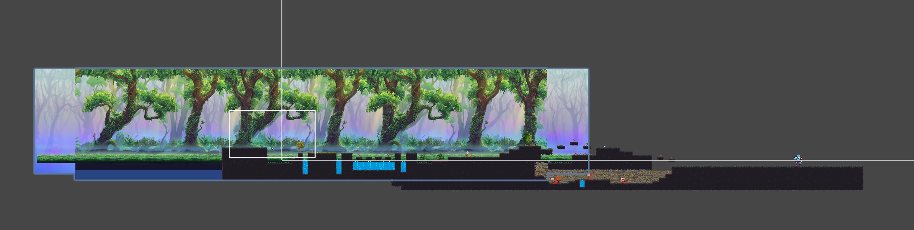
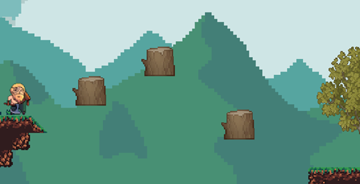

## Apurva Mishra
My tasks in the second milestone consisted of implementing the Final Level for Lumberjack Warrior. In addition to this, I also created a fully functional level boss for the final level.

### Level Design

I kept my level design simple to draw attention to the boss fight. There are no puzzles or complex obstacles. I used Unity's Tilemap system with a Rule Tile to place terrain efficiently. The Rule Tile let me automate edge and corner placements without needing to paint each tile by hand.

For the background, I used a multi-layer parallax effect to add depth. I applied Rajib’s `ParallaxInfiniteScroll` script and tuned four layers to scroll at different speeds. Each layer loops as the player moves, giving the level a smooth and immersive visual flow.



### Arena Lock System

To contain the player within the arena while the boss fight plays out, I built an arena lock. When the player enters the trigger zone, invisible walls activate and trap them inside. This is handled by the `ArenaController`:

```csharp
public class ArenaController : MonoBehaviour
{
    [SerializeField] private GameObject[] arenaWalls;

    public void LockArena()
    {
        foreach (var wall in arenaWalls)
            wall.SetActive(true);
    }

    public void UnlockArena()
    {
        foreach (var wall in arenaWalls)
            wall.SetActive(false);
    }
}
```


### Boss AI System

The boss runs on a custom state machine. Each state follows the Single Responsibility Principle and is defined using the `IBossState` interface. This setup makes it easier to manage transitions between behaviors like intro, attack, and death.

The boss detects when the player is within decision range and either chases or attacks. Movement is restricted to the X-axis, and walking is paused during attacks or special animations. The `BossAttackState` handles this logic:

```csharp
public class BossAttackState : IBossState
{
    private readonly BossController boss;

    public BossAttackState(BossController boss)
    {
        this.boss = boss;
    }

    public void Update()
    {
        var state = boss.Animator.GetCurrentAnimatorStateInfo(0);
        if (state.IsTag("attack") || state.IsTag("hit") || state.IsTag("death") || state.IsTag("intro"))
        {
            boss.SetWalking(false);
            return;
        }

        boss.FacePlayer();

        float distance = Vector2.Distance(boss.transform.position, boss.Player.position);

        if (distance <= boss.AttackDecisionRange)
        {
            boss.SetWalking(false);
            if (boss.IsAttackCooldownReady())
                boss.TryAttack();
        }
        else
        {
            boss.SetWalking(true);
            Vector3 target = boss.Player.position;
            target.y = boss.transform.position.y;
            boss.transform.position = Vector3.MoveTowards(
                boss.transform.position,
                target,
                boss.ChaseSpeed * Time.deltaTime
            );
        }
    }

    public void Enter() => boss.SetWalking(false);
    public void Exit() => boss.SetWalking(false);
}
```

### Boss UI and Health

I added a health bar that stays hidden until the boss fight starts. When the player enters the arena, the boss triggers its intro animation, and the UI is initialized:

```csharp
public void StartBossFight()
{
    if (hasStarted) return;
    hasStarted = true;

    if (bossHealthUI != null)
        bossHealthUI.SetMaxHealth(maxHealth);

    animator.SetTrigger("intro");
    stateMachine.ChangeState(new BossIntroState(this));
}
```

The health bar updates as the boss takes damage. When health reaches zero, the boss plays a death animation and is destroyed.

### Boss Attacks

The boss randomly chooses between three attack types. Each attack has its own animation and hitbox. The system uses `Physics2D.OverlapCircle` to detect if the player is in range.

When hit, the boss flinches and loses health. This feedback helps the player know when they’ve landed a successful hit.

---

## Pramesh Shrestha (325833)

### Implementation of Level 1 and Environmental Design

For the second milestone, I focused on implementing Level 1 of the game and designing its environment to match the theme and gameplay experience we envisioned for Lumberjack Warrior.

We decided to divide the game into three levels: Level 1, Level 2, and the Final Boss Fight Level. I took responsibility for building Level 1 and began by researching the best practices for level design in Unity. During this process, I learned about Rule Tiles, which provide an efficient way to construct 2D game levels. After watching YouTube tutorials and experimenting with the tool, I chose this approach for building the level.

### Assets and Visual Style

To match the game’s forest-based concept, I searched for suitable tile sets and backgrounds. I downloaded a forest-themed tile map and a layered background on the Unity Asset Store. I also downloaded a full bundle of environmental assets, including trees, road signs, hazards, rocks, grass, and logs from Unity Asset Store. These assets are used not only in Level 1 but also across other levels for consistency. For the health collectibles, I used an image found online that blends well with the natural forest theme.

### Designing Level 1 Using Rule Tiles

To speed up level creation and keep the layout consistent, I used a Rule Tile setup like the one shown in the image below. A Rule Tile automatically places the correct tile sprite based on neighbouring tiles, which reduces repetitive work and avoids visual errors. For example, corner pieces, flat ground, and side edges are all chosen dynamically based on what tiles are placed nearby.

In Unity, I configured rules by assigning sprites to different conditions like placing a certain tile if there’s another tile to the left, right, or below.

 

*Figure 1: Rule tile of Level 1*

As a result, I could paint large sections of terrain while the Rule Tile system handled the details. This saved time and helped create a cleaner, more natural-looking environment as shown in figure below.


*Figure 2: Level 1 Terrain*

### Overall Level 1 Design

The level design introduces a balance of challenge, strategy, and engagement through a variety of mechanics:

- **Combat and Hazards**: The player must defeat enemies and avoid hazards like water pits. Mistimed jumps result in instant death, adding tension and encouraging careful play.


*Figure 3: Water pits in Level 1*

This is handled using a DeathPlane script, which detects when the player falls into water. The script uses Unity’s OnTriggerEnter2D method to check if the object entering the water zone has the tag "Player". If it does, it retrieves the PlayerController component attached to the player and calls the PlayerDie() method to trigger the player’s death logic. Additionally, it calls the DisplayGameOverScreen() function from the UIController, which shows a game over screen with a short delay of 0.1 seconds. The code snippet below shows the implementation of this logic:

```csharp
public class DeathPlane : MonoBehaviour
  {
    private void OnTriggerEnter2D(Collider2D other) {
      if (other.CompareTag("Player")) {
        Debug.Log("Player death");
          PlayerController player = other.GetComponent<PlayerController>();
            if (player != null) {
                player.PlayerDie();
            }
        if (UIController.instance != null) {
          UIController.instance.DisplayGameOverScreen(0.1f);
        }
        
      }
    }
```

- **Box Puzzle**: One puzzle involves pushing a box to be able to jump over to the other side without falling into water as shown in image below. If the player pushes the box too quickly or carelessly, the box falls into the water, making it impossible to proceed. This mechanic demands attention and patience.


*Figure 4: Box Puzzle in Level 1*

- **Falling Log Puzzle**:
  Another puzzle challenges the player to jump across floating logs. These logs fall shortly after being touched, requiring quick and precise movements. The image below shows that part of the level.



*Figure 5: Falling Log Puzzle in Level 1*

This script controls the log that begins to fall when the player touches it. When the log detects a collision with the player and it hasn’t already started falling, it sets a flag (isFalling) to true and triggers a delayed action using Invoke. After the specified delay (fallDelay), the StartFalling method is called, which makes the log non-kinematic so that it is affected by physics, and sets its gravity scale to fallSpeed, causing it to fall. The script for the falling log is below:

```csharp
    private void OnCollisionEnter2D(Collision2D collision)
    {
        if (collision.gameObject.CompareTag("Player") && !isFalling)
        {
            isFalling = true;
            Invoke("StartFalling", fallDelay);
        }
    }

    void StartFalling()
    {
        rb.isKinematic = false;
        rb.gravityScale = fallSpeed; 
    }
```
These mechanics reflect several Aesthetics of Play:

- Challenge: The precise jumps and strategic puzzles require skill and timing.
- Discovery: Players uncover how each puzzle works as they progress.
- Sensation: The dynamic environment with falling logs and moving platforms creates an engaging, almost physical response.
- Narrative: Environmental storytelling is used through the natural layout, road signs, and hazard placement to suggest danger, progress, and pathfinding.

### Game Flow and Design Decisions

Level 1 allows players to jump over enemies to avoid combat. This was a conscious choice due to the absence of checkpoints. If the player dies, they must restart the level from the beginning, so allowing combat to be optional gives players some control over risk.

The environment feels alive and natural, with varied trees, terrain, and visual cues that guide players without breaking immersion. Health collectibles are placed strategically throughout the level to support players who explore or take more damage during combat.

### Infinite Parallax Background

To enhance the depth and visual quality of the level, I implemented an infinite parallax scrolling background. I selected a background with five distinct layers. Each layer moves at a different speed relative to the camera to simulate depth - layers closer to the camera move faster than those farther away.

In the Unity hierarchy, the setup is organized under a parent object called ParallaxBackground, as shown in the image below. Each background layer (from BGLayer1 to BGLayer5) contains two child objects. These child objects are duplicates of the same background image, placed side by side. As the camera moves, the background layers scroll horizontally.


*Figure 6: Parallax Background Setup in Unity*

When one of the background images moves out of view, its position is reset to the other side of the pair, creating a seamless looping effect. This structure allows for a continuous scrolling environment, giving the illusion that the player is moving through an endless forest. The image below highlights one of the layers from the parallax background setup.


*Figure 7: Parallax Background Layer in Level 1*

### Enemy Animations and Damage Logic

I created animations for two enemy types: a skeleton and a rolling rock. The skeleton sprite was downloaded from monopixelart.itch.io, while the rock was part of a Udemy course resource. Both enemies were animated using Unity’s Animator system with idle and walk states. Additionally, the skeleton has an attack animation to make it more dynamic during combat.

To support combat, I also added logic that allows the player to damage enemies. The script checks whether the player’s attack hits any enemy within a certain range. It uses Unity’s Physics2D.OverlapCircleAll method to detect all colliders in the defined enemyLayer around the attackPoint.

Each hit collider is then checked using TryGetComponent to see if it is an enemy. If it's an enemy, the TakeDamage() method is called on that enemy.

The code snippets below show the full implementation of this logic in the project:

```csharp
      public void DamageEnemy()
        {
            Debug.Log("Attempting to damage enemy...");

            Collider2D[] hitEnemies = Physics2D.OverlapCircleAll(attackPoint.position, attackRange, enemyLayer);

            foreach (Collider2D enemyCollider in hitEnemies)
            {
                if (enemyCollider.TryGetComponent(out Enemy enemy))
                {
                    enemy.TakeDamage(attackDamage);
                    Debug.Log($"Damaged Enemy: {enemy.name}");
                }
                else if (enemyCollider.TryGetComponent(out BossController boss))
                {
                    boss.TakeDamage(attackDamage);
                    Debug.Log($"Damaged Boss: {boss.name}");
                }
            }
        }
```
```csharp
    public void TakeDamage(int damage) {
            EnemyHealth.DecreaseEnemyHealth(damage);
        }
```
---

## Rajib Paudyal (325836)

For milestone two, I focused on designing and building Level 2 of our game. This included creating the tilemap layout,
decorating the environment and implementing two interactive puzzles.

### Tilemap Creation with Rule Tiles


I built the level layout using Unity’s Tilemap system. To streamline the process, I used Rule Tiles for placing terrain.
Rule Tiles allowed me to define how tiles behave based on their neighbors—automatically selecting corner, edge or
filler tiles depending on the surrounding context. This reduced the amount of manual painting needed and kept the
terrain visuals clean and consistent.


I separated the level into layers for collision, visuals and decorations. This helped organize the work and made it
easier to tweak parts of the level without affecting others.

### Background and Parallax Effect

After completing the core layout and decorations, I added a multi-layered background to enhance the level’s atmosphere.
The goal was to create a sense of depth and motion as the player moves through the level. To achieve this, I used a
parallax scrolling effect. Each background layer moves at a different speed relative to the camera, with distant layers
moving slower and closer layers moving slightly faster. This mimics depth and makes the scene feel more dynamic.

I implemented the effect using a custom script called `ParallaxInfiniteScroll`. The script uses the camera's movement to
update each background layer’s position, giving the illusion of depth. It also supports horizontal wrapping so that the
background repeats seamlessly as the player moves. It calculates a new position based on the camera’s X movement
multiplied by a parallax factor. When the camera moves beyond the sprite’s width, it shifts the background’s start
position to create a seamless loop.

```csharp
private void FixedUpdate()
{
    float temp = (_camera.transform.position.x * (1 - _parallaxEffectX));
    float dist = (_camera.transform.position.x * _parallaxEffectX);

    transform.position = new Vector3(_startPos.x + dist, _startPos.y, transform.position.z);

    // Now, wrap the background!
    if (temp > _startPos.x + _spriteWidth)
    {
        _startPos.x += _spriteWidth;
    }
    else if (temp < _startPos.x - _spriteWidth)
    {
        _startPos.x -= _spriteWidth;
    }
}
```

Each background layer uses this script with a different parallaxEffectX value to control how fast it moves. Lower values
create the effect of distant scenery, while higher values simulate layers closer to the camera.

I also used Unity's sorting layers to make sure the background renders behind gameplay elements and decorations. This
visual layering helps maintain clarity and focus while keeping the environment rich and engaging.

### Puzzles and Obstacles Implementation

#### Activate Lift Puzzle


In this puzzle, the player must use a crate to activate a lift. The setup includes a trigger platform and a moving lift
mechanism. When the player pushes the crate onto the trigger, the system checks if the crate is correctly positioned and
fully pressing down.

```csharp
float distance = Vector2.Distance(transform.position, triggerPoint.position);

if (!_triggered && _isBeingPushedByBox && distance < triggerThreshold)
{
    _triggered = true;
    onFullPushed.Invoke();
}
```

This is done by measuring the distance between the trigger and a predefined point and confirming
the object in contact is tagged as a "Box". Once these conditions are met, the trigger fires a Unity event that calls
the `ActivateLift()` method which then calls `MoveLiftLoop()`.

```csharp
private IEnumerator MoveLiftLoop()
{
    while (true)
    {
        var target = _isMovingUp ? topPoint.position : bottomPoint.position;

        while (Vector3.Distance(movingBase.position, target) > 0.01f)
        {
            movingBase.position = Vector3.SmoothDamp(movingBase.position, target, ref _velocity, smoothTime);
            yield return null;
        }

        movingBase.position = target;
        _velocity = Vector3.zero;
        
        yield return new WaitForSeconds(waitTimeAtEnd);
        
        if (_shouldStop && !_isMovingUp)
            break;

        _isMovingUp = !_isMovingUp;

        // If should stop and we are now going down, return to bottom and stop
        if (_shouldStop && !_isMovingUp)
            break;
    }
    
    // Ensure it snaps to bottom if stopped
    movingBase.position = bottomPoint.position;
    _velocity = Vector3.zero;
    _isRunning = false;
    _isMovingUp = false;
}
```

The lift then begins moving smoothly between a bottom and top point using `Vector3.SmoothDamp`, creating a natural
vertical motion. At each endpoint, the lift pauses briefly before reversing direction. The movement loop continues until
the system receives a stop signal through `DeactivateLift()`, which lets the lift return to the bottom and stop
completely. This puzzle introduces crate interaction and vertical traversal, encouraging the player to observe how
objects in the world can be used to unlock movement options and access new areas.
!

#### Torch Puzzle


This puzzle requires the player to light all torches within a limited time to activate a moving platform. Each torch
uses the `TorchController` script, which lights the flame and gradually fades it out using a coroutine:

```csharp
public void ActivateTorch()
{
    if (IsLit || _isOnCooldown) return;

    IsLit = true;
    torchFlame.intensity = 2;
    _animator.SetBool("isLit", true);
    OnTorchStateChanged!.Invoke(this);
    StartCoroutine(CooldownRoutine());
}

```

The `TorchPuzzleManager` checks the state of all torches whenever one changes. If all are lit, it activates the platform:

```csharp
private void CheckTorches(TorchController changedTorch)
{
    foreach (var torch in torches)
    {
        if (!torch.IsLit)
        {
            platform.DeactivatePlatform();
            return;
        }
    }

    platform.ActivatePlatform();
}

```

The `PlatformMover` script then moves the platform up and down using `Mathf.PingPong`. This interaction adds pressure and
timing, rewarding the player with vertical access when they succeed.

#### Crusher


The crusher obstacle features a set of heavy wooden blocks that move up and down in a loop, simulating a crushing
motion. Each crusher uses a coroutine to animate vertical movement by scaling the Y-axis between a maximum and minimum
value.

```csharp
float newYScale = Mathf.MoveTowards(movingPart.localScale.y, targetY, scaleSpeed * Time.deltaTime);
movingPart.localScale = new Vector3(movingPart.localScale.x, newYScale, movingPart.localScale.z);
```

While scaling down, the crusher appears to slam toward the ground. At the same time, its collider adjusts size
and offset to match the new visual shape, allowing accurate hit detection with the player.

```csharp
_collider.size = new Vector2(_originalSize.x, _originalSize.y * newYScale);
float heightDiff = (_originalSize.y - _originalSize.y * newYScale);
float newYOffset = _originalOffset.y + (heightDiff / 2f);
_collider.offset = new Vector2(_originalOffset.x, newYOffset);
```
The crusher alternates between scaling down and up, with a pause (`WaitForSeconds`) between each slam. This loop runs
indefinitely, creating a repeating hazard the player must time their movement around to avoid being hit.

---

