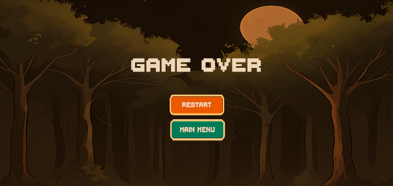

## Apurva Mishra

---

## Pramesh Shrestha (325833)

For the third milestone, we decided to accomplish UI screens for the player experience and adding sound effects and background music. Menu screens included menus like the main menu, pause menu screen, game over menu screen, and loading screen. Audio included adding background tracks for different levels, player actions such as attack, hurt, jump, and death, as well as enemy actions like attack, hurt, and death.

### UI Menus

I created the following menus for the game:

- Main Menu Screen

- Pause Menu Screen

- Game Over Menu Screen

### Main Menu Screen

The main menu was built as a separate scene. In my opinion, this is a good approach because it helps keep the game logic and UI cleanly separated. When the game launches, only the main menu loads, reducing unnecessary memory usage. It also allows the player to return to the menu without reloading all gameplay elements. The background image creates a forest atmosphere that matches the theme of “Lumberjack Warrior”, helping set the tone right from the start.

When the screen loads, the Start button is highlighted by default as can be seen in the Main menu figure below. Players can navigate the menu using a mouse, keyboard, joystick, or controller. This flexibility ensures accessibility across different input methods.

The main menu provides three options – Start, Controls and Quit.


*Figure 1: Main Menu*

When the Start button is selected, the game transitions from the main menu to Level 1. This is handled by the following method:

```csharp
   public void StartGame()
        {
            if (SceneLoader.Instance != null)
            {
                SceneLoader.Instance.LoadScene(SceneManager.GetActiveScene().buildIndex + 1);
                AudioManager.Instance.StopMenuAudio();
            }
            else
            {
                Debug.LogError("LoadingScene not found in the scene!");
            }
        }
```

This method checks if the SceneLoader instance exists. If it does, it loads the next scene in the build index (which is Level 1) and stops the background music playing in the menu.

When the Quit button is selected, the game closes. This is done with the following simple method:

```csharp
public void QuitGame()
        {
            Application.Quit();
        }
```

This tells Unity to close the application. In the editor, this won’t visibly quit the game, but in a built version, it exits the program entirely.

### Pause and Game Over Menu Screens

In contrast, the pause menu and game over screen were created as UI panels within the main game scene. In my opinion, this is more efficient for in-game menus since it avoids the overhead of switching scenes during gameplay. However, game over screen could have been made as a separate scene. This approach would also have been a good idea as it helps keep the project structure more organized and separates gameplay logic from end-of-game UI. However, I chose to keep it in the same scene to avoid scene reload delays and to provide a smoother, uninterrupted experience for the player.

The pause menu screen allows players to pause the game and choose what to do next. It includes four buttons – Restart, Resume, Main Menu and Quit as can be seen in figure below.


*Figure 2: Pause Menu*

When the pause button is pressed, the PauseGame() method is triggered. It toggles the visibility of the pause menu panel and adjusts the game’s Time.timeScale value. If the pause screen is active, time is frozen by setting Time.timeScale = 0; if it is inactive, time resumes by setting it back to 1. This is done to stop all gameplay-related movement and animations while the game is paused.

The ResumeGame() method is used when the player selects the Resume button. It simply hides the pause menu and sets Time.timeScale back to 1 to continue gameplay. When the player chooses to return to the main menu, the MainMenu() method loads the "MainMenu" scene, allowing the game to cleanly transition back to the main interface. Finally, the QuitGame() method calls Application.Quit(), which closes the game.

The game over screen appears when the player dies, giving a clear visual indication that the game has ended. It features a simple layout with two buttons - Restart and Main Menu as can be seen in figure below.



*Figure 3: Game Over Menu*

The layout is kept minimal to focus attention on the player’s next choice and encourage them to quickly try again or return to the main menu. The visual design and layout remain consistent with the rest of the game, maintaining a unified look and feel.

To make the transition to the game over screen feel smoother, a short delay is added before the screen appears. This is done using a coroutine, as shown in the following method:

```csharp
    public void DisplayGameOverScreen(float delaySeconds)
        {
            
            StartCoroutine(ShowGameOverScreenAfterDelay(delaySeconds));
        }
```

This method starts a coroutine named ShowGameOverScreenAfterDelay, which waits for the number of seconds passed in through delaySeconds before showing the game over UI. Using a coroutine in this way allows the screen to appear after a brief pause without freezing the game.

### Main Menu Audio

I also added a background music to the main menu. The music plays automatically when the menu scene loads. This is handled using the AudioManager class. In the Start() method of the main menu script, I included the following code:

```csharp
      public class MainMenu : MonoBehaviour
    {
        void Start()
        {
            if (AudioManager.Instance != null)
            {
                AudioManager.Instance.PlayMenuAudio();
            }
            else
            {
                Debug.LogError("AudioManager not found in scene!");
            }
        }
    }
```

This method runs as soon as the main menu scene starts. It first checks if the AudioManager instance exists (to avoid null reference errors). If it does, it calls PlayMenuAudio(), which plays the assigned menu background track. Using the Start() method ensures that the music begins immediately without needing any player input.

---

## Rajib Paudyal (325836)

For milestone 3, my main focus was improving the player experience through UI additions, audio integration and visual
polish.

### Loading Screen and Scene Transitions

I started by creating a dedicated loading screen that appears between scene transitions. It includes a
background image and a progress bar that fills as the next scene loads, providing feedback and keeping the game flow
smooth.


Using Unity’s `AsyncOperation`, I created a coroutine in the `SceneLoader` script that displays a loading screen with a
progress bar while the next scene loads in the background. Once loading completes, the screen fades out and the new
scene begins.

```csharp
IEnumerator LoadSceneAsync(int sceneId)
{
    loadingScreen.SetActive(true);

    AsyncOperation operation = SceneManager.LoadSceneAsync(sceneId);
    
    while (!operation.isDone)
    {
        float progress = Mathf.Clamp01(operation.progress / 0.9f);
        loadingBarFill.fillAmount = progress;
        yield return null;
    }
    
    PlayLevelMusic(sceneId);
    loadingScreen.SetActive(false);
}
```

I also connected scene changes with level-specific audio by calling `PlayLevelMusic(sceneId)` after loading
finishes. This method plays different background tracks depending on the level using the `AudioManager`, enhancing the
atmosphere of each stage. This setup not only improves player feedback during transitions but also ensures audio starts
at the right time, creating a smoother and more immersive experience.

```csharp
private void PlayLevelMusic(int sceneId)
{
    switch (sceneId)
    {
        case 1:
            AudioManager.Instance.PlayLevelAudio(LevelType.Level1);
            break;
        case 2:
            AudioManager.Instance.PlayLevelAudio(LevelType.Level2);
            break;
        case 3:
            AudioManager.Instance.PlayLevelAudio(LevelType.Boss);
            break;
        default:
            Debug.LogWarning("No music assigned for this scene.");
            break;
    }
}
```

I also implemented a controls screen accessible from the main menu. This screen displays the input layout for both
keyboard and gamepad, helping players understand how to interact with the game. Navigation within this UI was set up
using Unity’s EventSystem to ensure proper button selection and input handling.

In addition to UI work, I added audio to various levels and the player character. Background music now plays per level,
and the player has sound effects for jumping and other actions, enhancing immersion. I also fixed several bugs from
Level 2, including visual glitches, misaligned tiles, and small lighting issues. Overall, I focused on polishing Level
2’s visuals to bring consistency and improve the overall quality of the gameplay experience.

### Controls Screen


I also created a dedicated controls screen to help players understand the input layout. The screen clearly displays the
actions such as attack, jump, interact, UI select and pause—mapped to both keyboard and gamepad buttons. I designed the
layout to match the game’s visual style, using custom icons, color-coded buttons and a wooden frame for consistency.
The screen is accessible from the main menu and includes a "Go Back" button, with proper input navigation using Unity’s
EventSystem for smooth interaction with both keyboard and controller. This screen improves player onboarding and makes
the controls easy to reference.

### Audio Integration

To enhance feedback and immersion, I integrated audio into both player actions and level environments. I organized all
sound assets into clear categories—Levels, Player and Misc—making them easier to manage. Each level has its own
background music and the player has distinct sound effects for jumping, attacking, taking damage, dying and picking up
health. These were triggered through code and tied into gameplay events, helping reinforce actions and improve the
game’s overall feel. A "Level End" sound was also added under the Misc section to mark scene transitions.


---


