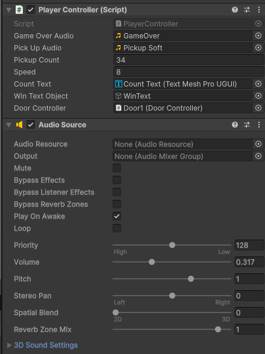
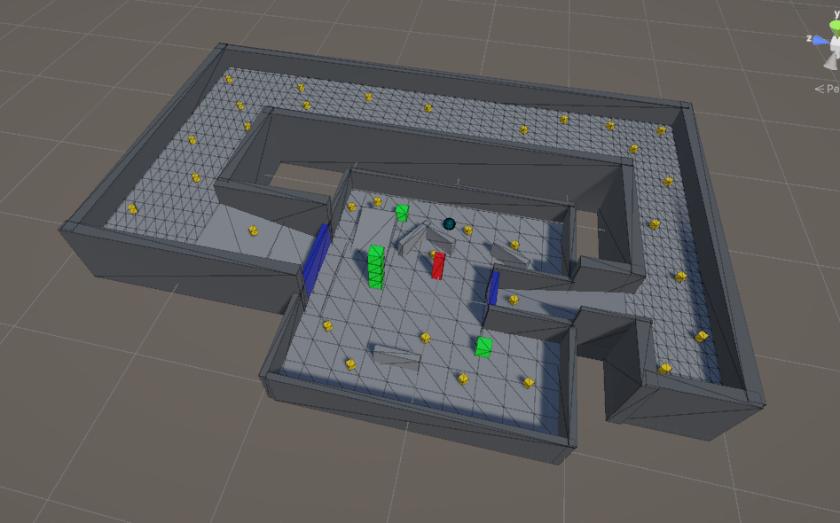
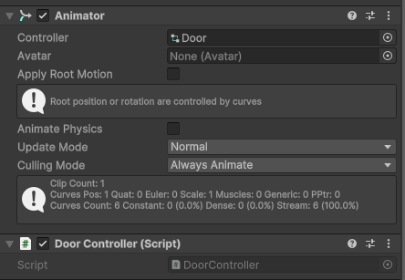
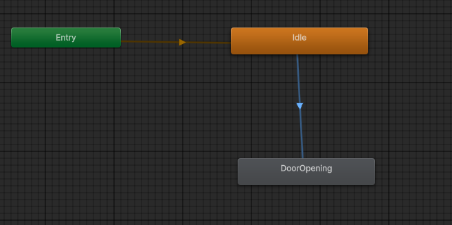

# Roll a Ball: How We Expanded the Game

For out Game Development course, we started with Unity's Roll-a-Ball tutorial and built on it by adding new mechanics,
level design elements and interactive features. Here's a breakdown of what we changed and how we made it happen.

## 1 Adding Sound Effects

We wanted the game to feel more engaging, so we added sound effects for different events.

- A pickup sound when collecting items.
- A door unlocking sound when all required pickups are collected.
- A death sound when the player collides with a enemy.

Adding sound effects to the game involved using AudioClips, AudioSource component and triggering sound through C#
scripts.

### Audio Setup in Unity



In the PlayerController script, we added two AudioClips fields. These allow us to assign
different sounds from Unity Inspector, making it easier to modify them without changing code. We also assigned an
AudioSource component to the player, which acts as the sound player.

```c#
[SerializeField] private AudioClip gameOverAudio;
[SerializeField] private AudioClip pickUpAudio;
```

### Playing Sounds When Collecting a Pickup

In `OnTriggerEnter()` function, we play a sound when the player collects a pickup. So, whenever player touches an object
tagged "Pickup", it disappears. And, then score count increased. At last, pickupAudio sound is assigned to AudioSource
and it is played.

```c#
private void OnTriggerEnter(Collider other)
        {
            if (other.gameObject.CompareTag("Pickup"))
            {
                other.gameObject.SetActive(false);
                _count += 1;
                SetCountText();
                _audioSource.clip = pickUpAudio;
                _audioSource.Play();
            }
        }
```

### Playing a Sound When the Player Loses

When the player collides with an enemy, the `gameOverAudio` sound is played to signal the loss. Instead of instantly
removing the player from the game, the script ensures that the player is destroyed only after the sound has finished
playing, using `gameOverAudio.length` as a delay. At the same time, the UI updates to display "You Lose!", making the
game-over state clear to the player. This approach ensures a smoother transition and provides immediate audio-visual
feedback, enhancing the overall player experience.

```c#
private void OnCollisionEnter(Collision collision)
        {
            if (collision.gameObject.CompareTag("Enemy"))
            {
                _audioSource.clip = gameOverAudio;
                _audioSource.Play();

                // Destroy the current object
                Destroy(gameObject, gameOverAudio.length);
                // Update the winText to display "You Lose!"
                winTextObject.gameObject.SetActive(true);
                winTextObject.GetComponent<TextMeshProUGUI>().text = "You Lose!";
            }
        }
```

## 2 Expanding the Level



The original tutorial had the player rolling around in a simple box-shaped area, but we wanted something more fun and
challenging. We expanded the original level by adding new platforms, pathways and obstacles to make the gameplay more
engaging. Initially, the game took place in a simple box-shaped area, but we extended it by introducing walls,
corridors and elevated sections, creating a more structured environment. This expansion allowed for a more dynamic
experience, requiring players to navigate through different spaces while collecting pickups and avoiding obstacles. By
placing objects strategically, we encouraged exploration and added a layer of challenge without fundamentally changing
the core mechanics of the game. This approach kept the level simple yet more immersive, enhancing the overall player
experience.

## 3 Unlock-able Door

To add a simple puzzle mechanic, we introduced a locked door that only opens after the player collects enough pickups.
To introduce a locked door mechanic that only opens when the player collects a required number of pickups, we used
Unity’s Animator system and scripting. The DoorController script is responsible for controlling the door
animation.

```c#
 public class DoorController : MonoBehaviour
    {
        private Animator _animator;
    
        private void Awake()
        {
            _animator = GetComponent<Animator>();
        }

        public void UnlockDoor()
        {
            _animator.SetTrigger("openDoor");
        }
    }
```

At the start, the `Awake()` function retrieves the Animator component attached to the door object. When the required
number of pickups is collected, the `UnlockDoor()` function is called, which triggers the `openDoor"` animation using _
`animator.SetTrigger("openDoor")`. This changes the door's animation state, allowing it to open.





The Animator component is linked to an animation controller, which manages how the door transitions
between states. The Animator state machine begins in the Idle state, and once the `"openDoor"` trigger is
set, it transitions to the DoorOpening animation. This ensures that the door remains locked until the necessary
conditions are met.